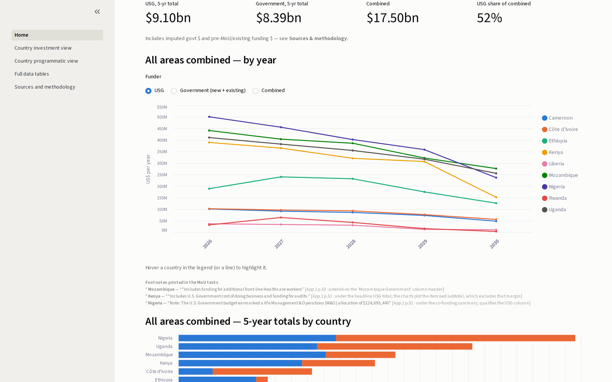

# USG MoU dashboard

**Live app:** https://usg-mou.streamlit.app/ · **Standalone explorer:** https://tafmeijer.github.io/USG_MOU/




Interactive dashboard tracking the **America First Global Health Strategy bilateral health
MoUs** (34 countries, five-year cooperation plans 2026–2030): who funds what, how U.S.
funding tapers while government co-financing ramps up, and the programmatic targets each
agreement commits to.

All information here is **publicly available** — amounts from the
[KFF tracker](https://www.kff.org/global-health-policy/kff-tracker-america-first-mou-bilateral-global-health-agreements/),
detailed tables transcribed from the **16 published full MoU texts** hosted by
[Public Citizen](https://www.citizen.org/article/u-s-bilateral-health-agreements-case-act-reporting/),
with [Health Policy Watch](https://healthpolicy-watch.news/) and
[Think Global Health](https://www.thinkglobalhealth.org/article/tracking-the-america-first-bilateral-health-agreements)
as secondary mirrors.

## How each text became public

Public Citizen's table marks every agreement with the route by which its text reached the
public, and the distinction is part of the story:

| Marker | Meaning | Countries |
|---|---|---|
| `*` | The U.S. government made the text public itself, via its **Case Act reporting page** | Uganda only |
| `*^` | Published on the Case Act page **and** released under FOIA | Kenya, Mozambique, Nigeria, Ethiopia, Malawi |
| `^` | Public **only** because of Public Citizen's **Freedom of Information Act** requests | Rwanda, Liberia, Lesotho, Eswatini, Cameroon, Sierra Leone, Botswana, Madagascar, Côte d'Ivoire, Burundi |

Ten of the sixteen public texts — and seven of the nine countries added in September 2026 —
exist in the public record only because Public Citizen sued the State Department for them. The
August 2026 production (FL-2026-00021) is what that litigation yielded. Both the marker and a
plain-language description are carried per country in `data/countries.csv`
(`Disclosure marker`, `How the text became public`), and 18 of the 34 signed agreements still
have no public text at all.

## Pages

| Page | What it shows |
|---|---|
| **Home (Overview)** | All countries side by side, per investment area — yearly trajectories and 5-year totals, with a **US$ ↔ % of combined** toggle |
| **Country investment view** | One country's small multiples across every investment area, with a USG / Govt (existing + new) / Both toggle and the same $/% toggle; the country name links to the source PDF |
| **Country programmatic view (v0)** | One country's indicator baselines & 2026–2030 targets (outcome / process / 7-1-7), each indicator as its own small chart |
| **Full data tables** | The complete budget and programmatic datasets across all countries — filterable, sortable, searchable, downloadable |
| **Sources & methodology** | Every link (trackers, mirrors, all 34 agreements), extraction method, and caveats |

`explorer.html` is a standalone, dependency-free version of the trajectory explorer —
open it directly in a browser, no Python needed. `docs/index.html` is the copy GitHub Pages
serves; both are regenerated from `data/budget_series.csv` by
`analysis/rebuild_explorer_data.py`.

## Theming

The app ships light **and** dark themes (`.streamlit/config.toml`); Streamlit's default
setting ("Use system setting") follows the browser/OS colour-scheme preference, and users
can still override it in the app menu. Explicit chart colours track the active theme via
`mou_lib.palette()` (`st.context.theme`), so donut strokes, centre labels, chip legends and
the handful of dark-adjusted series colours switch with it.

## Run locally

```bash
pip install -r requirements.txt
streamlit run Home.py
```

## Publish

1. Push this folder to a public GitHub repository:
   ```bash
   git init
   git add .
   git commit -m "USG MoU dashboard"
   git branch -M main
   git remote add origin https://github.com/<you>/mou-dashboard.git
   git push -u origin main
   ```
2. Deploy free on [Streamlit Community Cloud](https://share.streamlit.io): *New app* →
   pick the repo → main file `Home.py`. Every push to `main` redeploys automatically.

## Data

| File | Contents |
|---|---|
| `data/budget_series.csv` | Aggregated, safely summable series (Country × Investment area × Year × Funder) — feeds all budget charts |
| `data/budget_tidy.csv` | Full line-item detail as printed in each MoU, with `Row type` flags (subtotals, appendix breakdowns, existing funding), source notes, and the MoUs' own printed footnotes transcribed verbatim (`MoU footnote (verbatim)` / `MoU footnote location`) |
| `data/programmatic_tidy.csv` | Every Section-1 indicator: baseline + yearly targets, units, value types, source notes, and the MoUs' own printed footnotes (verbatim + location) |
| `data/countries.csv` | All 34 agreements: amounts, dates, program areas, source-PDF links |
| `data/sources.csv` | Reference trackers and mirrors |
| `data/strategic_areas.csv` | Strategic-investment domains/areas named in every MoU's §2.6, with printed prices and page references |
| `analysis/` | Derived analyses: $/FTE imputation scripts and outputs, cadre-table harvests (Mozambique, Uganda), baseline valuations, analysis notes |

**Summing rules** (see Sources & methodology page in the app): only `Row type = "Line item"`
rows plus existing-government rows are summed; the MoUs' own subtotals, nested appendix
breakdowns, FTE headcounts and domestic-expenditure pledges are excluded to avoid double
counting. "Government" = new co-financing **plus** existing funding where tabulated
(Nigeria, Ethiopia, Rwanda publish no existing split — their shares are understated).

## Provenance & caveats

**Read this before using the data.** All figures were transcribed from the sixteen signed
MoU texts in the public domain — released by the U.S. government via its Case Act reporting
page, or under Public Citizen's FOIA requests, and mirrored by Public Citizen, Health Policy
Watch and Think Global Health — and from the KFF tracker. The MoUs are
government-to-government cooperation documents that were **not originally drafted for
publication**; no official consolidated dataset of them exists, and this repository is an
independent research reconstruction. In particular:

1. **Amounts are plans, not obligations.** By the MoUs' own terms they are not
   international agreements and all activities are *subject to the availability of funds*.
   Nothing here represents appropriations, disbursements, or current implementation status,
   and the published scans may have been amended or superseded since.
2. **Figures are transcribed as printed**, including source-document errors (misprinted
   totals, conflicting appendices, internally inconsistent tables). These are preserved
   uncorrected and flagged in the `Source note` column.
3. **Derived values are clearly separated from printed ones.** Rows flagged
   `Imputed (derived - not printed in MoU)` / `Imputed baseline (pre-MoU - derived)` and
   series with `Basis` other than "Printed in MoU" are estimates produced by this
   project's documented methodology (FTE commitments priced at unit rates derived from
   the same documents) — they are never printed values, they carry stated confidence
   ranges, and every chart lets you toggle them off. See the app's *Sources &
   methodology* page and `analysis/` for full derivations.
4. Tables were machine-transcribed from the source PDFs and independently verified
   against them. Compiled August 2026. **Not an official product of any government or
   organisation**, and no affiliation with any party to the MoUs is implied. Content is
   provided as-is for research and transparency purposes; corrections are welcome via
   issues or pull requests.

## License

Code and derived data are released under the [MIT License](LICENSE). The underlying MoU
texts remain the work of their authors; transcription here is for research and
transparency purposes.

## Changelog

### September 2026 — the FOIA release

Public Citizen published the State Department's FOIA production (FL-2026-00021) on
30 August 2026. Public full texts went from 9 to **16 of 34**.

**Added:** Lesotho, Eswatini, Sierra Leone, Botswana, Madagascar, Malawi, Burundi — full
budget appendices, Section-1 indicator tables and §2.6 strategic areas.

**Re-sourced:** Rwanda, Liberia, Cameroon and Côte d'Ivoire now point at the official
release rather than a third-party mirror. Rwanda, Liberia and Cameroon are numerically
identical to the earlier copies (Rwanda was diffed word by word — no change).
**Côte d'Ivoire gained three Appendix 1 rows** that were illegible in the earlier scan:
Frontline Lab Workers $ ($2.1M), Frontline Healthcare Workers $ ($31.7M) and Management &
Operations $ ($29.2M), lifting its itemised U.S. total from $423.6M to $486.7M against a
printed $487.2M.

**South Sudan is still excluded** — the only available text is a pre-signature April 2026
draft; the agreement was signed on 25 June 2026 and its final text is not public.

**Pattern breaks worth knowing about:**

- **Botswana runs 2026–2028**, not 2026–2030. Its headline is not comparable to the others
  without adjusting for term length.
- **Botswana's U.S. line items do not reconcile** to its own printed totals in any year
  (−$3.6M over the term) — the only published MoU where the U.S. side fails to add up.
- **Burundi and Côte d'Ivoire print the 6% management-and-operations carve-out** as its own
  Appendix 1 line; elsewhere it is a silent gap (Lesotho, Madagascar and Botswana all sit
  exactly 6% below their headline).
- **The Appendix 1 government tables are mislabelled.** They are headed "total *new*
  planned financial support" but carry the §2.x.3 **Total Government Funding** column —
  new plus existing. True of the original nine as well.
- **Three new texts disagree with the KFF tracker**: Malawi ($744.8M/$55.0M vs
  $792M/$143.8M), Eswatini ($192.7M vs $205M) and Botswana ($99.6M vs $106M, exactly 6%).

**Build scripts:** `analysis/extract_aug2026_release.py` (indicator rows and the
provenance refresh) and `analysis/rebuild_budget_series.py` (regenerates
`data/budget_series.csv` from `data/budget_tidy.csv`).
